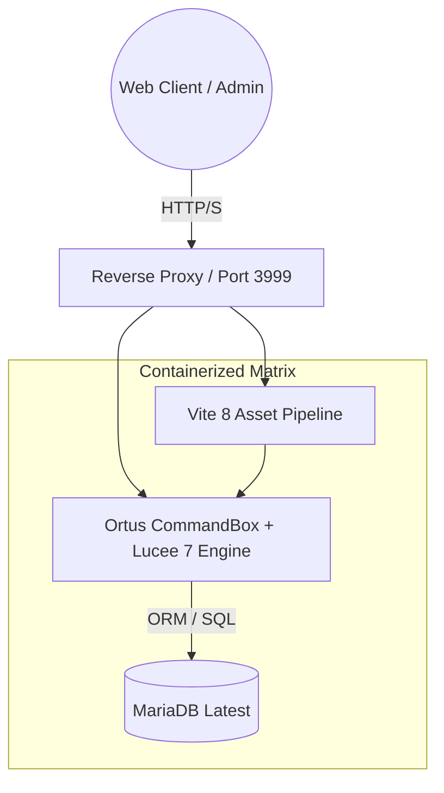

<div align="center">
  
  <br/>
  <h1>✨ 🏢 ROOM BOOKING SYSTEM (RBS) V2.0 ✨</h1>
  <p><strong>The Ultimate Enterprise-Grade Room Management Architecture</strong></p>
  <br/>

  [](https://lucee.org/)
  [](https://cfwheels.org/)
  [](https://mariadb.org/)
  [](https://getbootstrap.com/)
  [](https://vitejs.dev/)
  [](https://www.docker.com/)

  <br/>
  
  **[ 📖 Read the Full Installation Guide ](docs/INSTALL_DOCKER.md)** • **[ 🐛 Report Bug ](#)** • **[ ✨ Request Feature ](#)**
  
  <br/>
</div>

---

## 🌌 The Vision: Redefining Room Management

**RBS v2.0** is not just an update; it is a complete structural metamorphosis. Evolved from the classic OxAlto core, this iteration brings a radically modernized backend, military-grade security patches, and an ultra-premium **Dark Glassmorphism UI**. Designed specifically for high-availability enterprise environments, it combines seamless booking workflows with cutting-edge system architecture.

> *"Performance, Security, and Aesthetics—engineered into one seamless platform."*

---

## 🛠️ Elite Architecture Overview

Our infrastructure is built for maximum scalability and zero downtime. 



---

## 💎 Groundbreaking Features

### 🎨 Dark Glassmorphism Premium UI
* A visually stunning, highly immersive interface that leverages background blurring, vibrant gradients, and crisp typography.
* Complete visual overhaul of calendars, admin dashboards, and popups to ensure maximum user engagement.
* **FullCalendar 6.1** seamlessly styled to fit the futuristic dark-mode aesthetic.

### 🛡️ Iron-Clad Security Matrix
* **Intelligent Auto-Lockout:** Defeats brute-force attacks by locking IPs automatically after 5 failed attempts (10-minute cooldown).
* **Cryptographic Hardening:** Reset protocols now use salted, dynamically generated SHA-256 hashes instead of raw tokens.
* **Hermetic Session Isolation:** `RBS_INSTANCE_NAME` ensures complete namespace isolation across dev/prod environments deployed on the same server.
* **XSS Armor:** Deep-level escaping on all user-submitted data, rendering malicious script injections entirely obsolete.

### ⚡ Zero-Touch Automation & DevOps
* **One-Click Spawning:** The entire application and database ignite simultaneously via a finely-tuned `docker-compose-v3.yml`.
* **Auto-Installer Protocol:** The CFML wizard runs *automagically* upon first boot. No manual initializations required.
* **Vite 8 Supercharged Build:** Modern asset bundling ensuring lightning-fast JavaScript and CSS compilation.

---

## 🚀 Quick-Deploy Infrastructure (Docker)

To launch this masterpiece on your local or production environment, follow the supreme protocol below:

### 1️⃣ Clone & Initialize Matrix
```bash
git clone <repository-url>
cd /opt/RBS/app
cp .env.example .env
```
> ⚠️ **CRITICAL:** Open `.env` and assign your highly secure `DB_PASSWORD`, `DB_ROOT_PASSWORD`, and `ADMIN_EMAIL`.

### 2️⃣ Ignite the Containers
Deploy the application and database into their isolated environments.
```bash
docker-compose -f docker-compose-v3.yml up -d
```

### 3️⃣ Monitor the Launch
Verify that all subsystems are fully operational.
```bash
docker-compose -f docker-compose-v3.yml ps
```
Your application is now streaming live on port `3999`! 🎉

---

## ⚙️ Advanced Telemetry & Operations

| Command Operation | Shell Execution Strategy |
| :--- | :--- |
| **Hot Reload Engine** | `http://<server-ip>:3999/index.cfm?reload=roombooking` |
| **Monitor Live Telemetry**| `docker-compose logs -f appv3` |
| **Hard Reboot System** | `docker-compose restart` |
| **Terminal Access (App)** | `docker exec -it roombooking-a-appv3 /bin/bash` |
| **Direct Database Inject** | `docker exec -it roombooking-a-db mariadb -u roombooking -p` |

*(Note: Provide the DB password when prompted during the database inject).*

---

## 👑 The Mastermind Behind v2.0

Transforming a legacy system into a bleeding-edge enterprise software requires vision, relentless debugging, and architectural brilliance. 

This monumental v2.0 overhaul—covering the Vite 8 pipelines, Lucee 7 deployment structures, advanced XSS & brute-force security, and the beautiful Dark Glassmorphism interface—was entirely engineered, maintained, and revolutionized by:

<div align="center">
  <table>
    <tr>
      <td align="center">
        <h2>🧑‍💻 PG Mohd Azhan Fikri</h2>
        <strong>( <a href="https://github.com/HarryDotMYx">@HarryDotMYx</a> )</strong><br><br>
        <i>Software Architect & UI/UX Developer</i>
      </td>
    </tr>
  </table>
</div>

---

## ⚖️ License & Open Source Attribution

* **Original Blueprint:** OxAlto Room Booking System — © Tom King ([@neokoenig](https://github.com/neokoenig))
* **License Protocol:** Apache License 2.0

*This radically overhauled maintainer fork represents the pinnacle of modern CFML deployment, standing as a testament to open-source evolution and dedicated software craftsmanship.*
